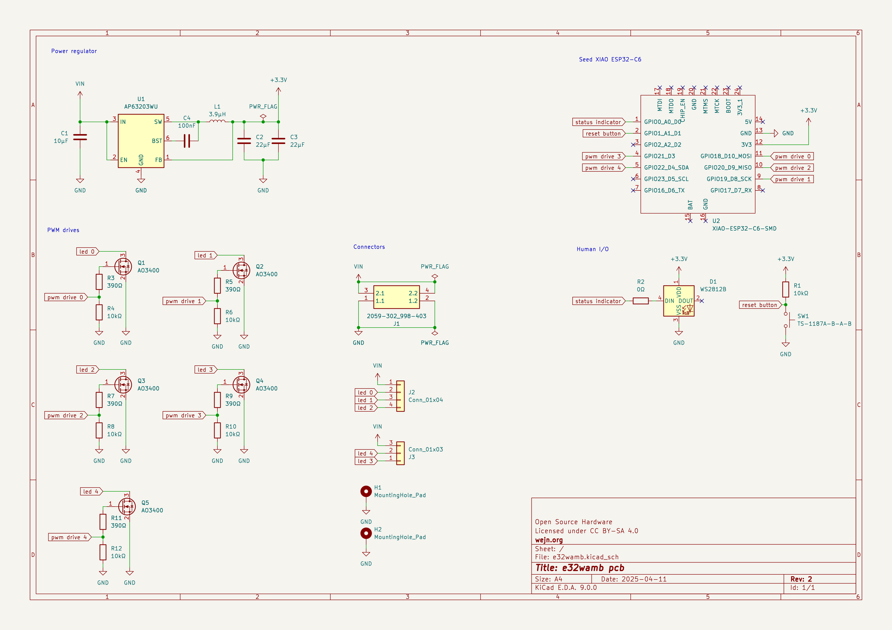
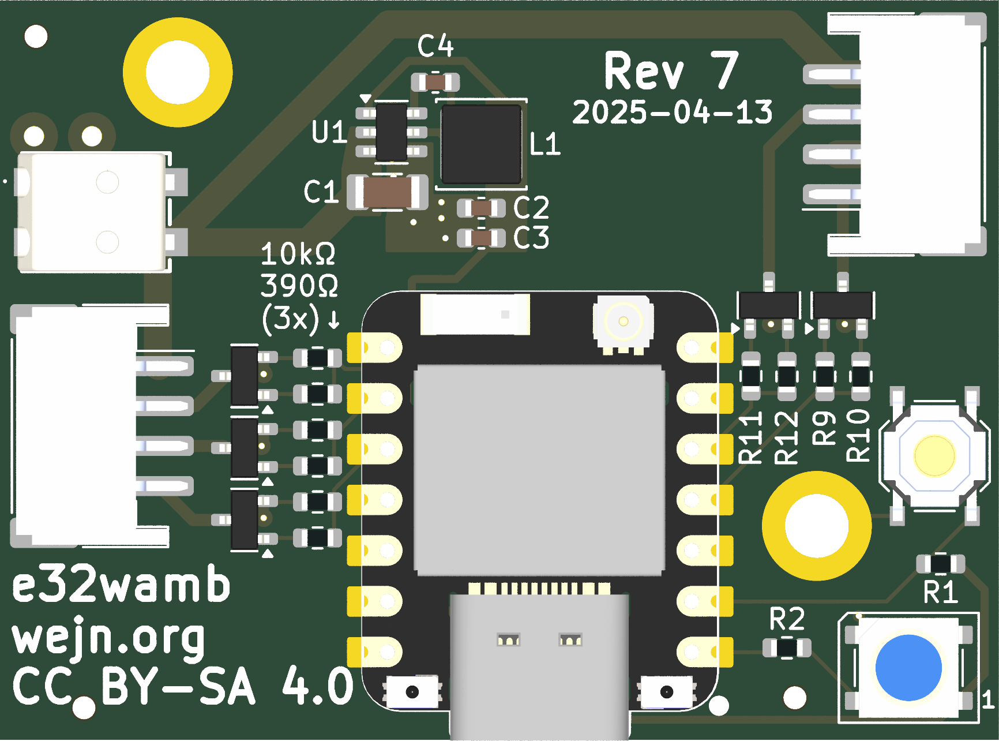

# Hue White Ambiance replacement using ESP32

**Note: This is work in progress, not guaranteed to be usable.**

This will be a pcb for my Hue White Ambiance replacement driver
suitable for my "Beng Ceiling Light" from Philips.

For background info see
[Reversing Philips Hue light driver](https://wejn.org/2024/12/reversing-philips-hue-light-driver/),
or directly the [Final stretch for e32wamb: PCB, cables, antenna
holder](https://wejn.org/2025/05/finishing-stretch-for-e32wamb-pcb-cables-antenna-holder/)
post that discusses the PCB in particular.

## Pretty pictures

## License

See the `LICENSE.md` file (tl;dr: CC BY-SA 4.0 for anything by me)
